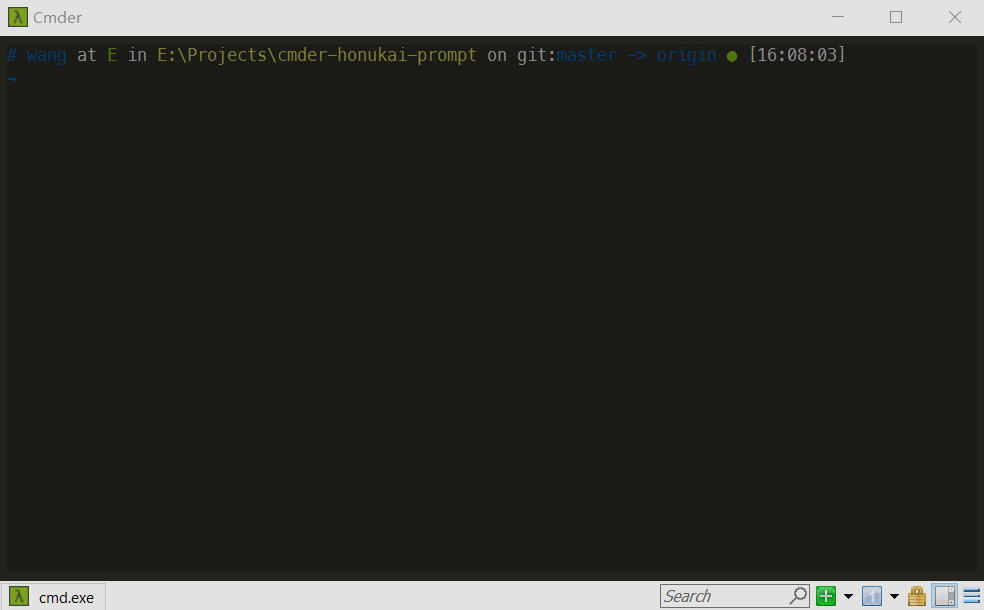
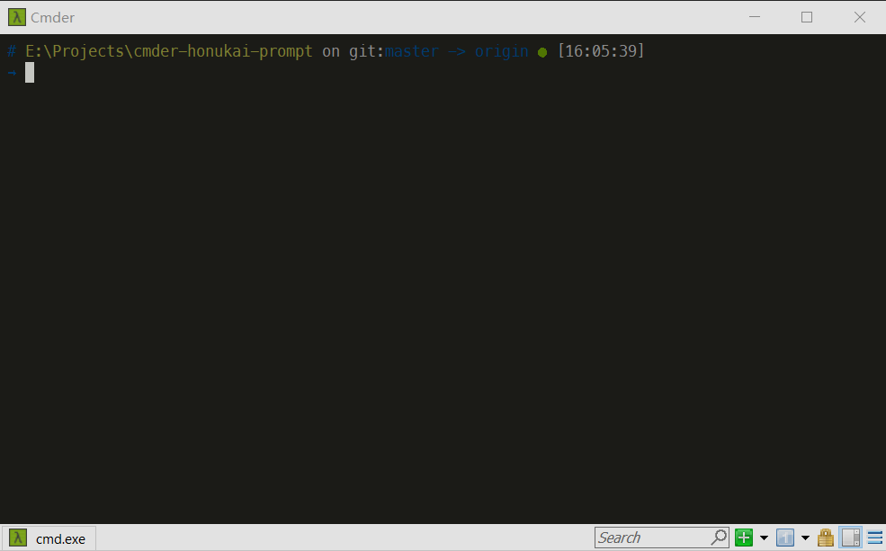

# Cmder-honukai-prompt

This is a custom prompt for [Cmder](http://cmder.net/) (the alternative console emulator for Windows). This project is inspired by [Zsh's theme honukai](https://github.com/oskarkrawczyk/honukai-iterm-zsh), [cmder-powerline-prompt](https://github.com/AmrEldib/cmder-powerline-prompt) and [Oh-my-posh's Honukai theme](https://github.com/JanJoris/oh-my-posh/blob/master/Themes/Honukai.psm1).
It looks like this: 


#Requirements

I'm not sure if the style will display wrong when you use some fonts. I recommend you to install [powerline fonts](https://github.com/powerline/fonts).

## Font
- Go to Cmder Settings > Main
- Choose Main console font to be what you prefer
- Choose _Alternative font_ to be *Meslo LG M for Powerline* or any font that can make the prompt display correctly

# Usage

Download the `.lua` file, and place it in `%CMDER_ROOT%/config` folder.
Restart Cmder to load the prompt.

__Alternatively__, if you want to maintain link with the original repo, you can clone this repo into any folder
`git clone https://github.com/0NG/cmder-honukai-prompt.git git-repo-folder-name`
then create a symbolic link from the `%CMDER_ROOT%/config` folder to the `.lua` file.
```
cd %CMDER_ROOT%/config  
mklink /H cmder-honukai-prompt.lua <git-repo-folder-name>/cmder-honukai-prompt.lua 
```

## Configuration

You can set the prompt to show your username or not.

To do this, just open the `.lua` file in your text editor, and fill in the *username* at line 4. If *username* is not empty, your username will not display in the prompt. Like this:



# Helpful info for customizing Cmder 

## Links
[Cmder Source Code and README](https://github.com/cmderdev/cmder)
[What is Clink](https://github.com/mridgers/clink/blob/master/docs/clink.md)
[Clink API](https://github.com/mridgers/clink/blob/v0.4.9/docs/api.md)
[ANSI Color Sequence](http://ascii-table.com/ansi-escape-sequences.php)

## Cmder Configurations
Cmder configurations is stored in `%CMDER_ROOT%\config\`
You can add files to be loaded during startup in either of these folders
        `%CMDER_ROOT%\config\profile.d`  
        `%CMDER_ROOT%\config`  
Add a `.ps1` file to be loaded for Powershell shells
Add a `.bat` or `.cmd` files to be loaded for Windows Command shells
Add a `.sh` file to be loaded for Bash shells
User-specific configurations should go into files named `user-profile` with extensions `ps1`, `cmd`/`bat`, or `sh`.

## Clink Prompt 
The file `%CMDER_ROOT%\vendor\clink.lua` sets the command prompt. See the function `set_prompt_filter`.
The prompt value is stored in [clink.prompt.value](https://github.com/mridgers/clink/blob/master/docs/api.md#clinkpromptvalue)
Drop .lua files into the `%CMDER_ROOT%\Config` folder to customize the prompt.
